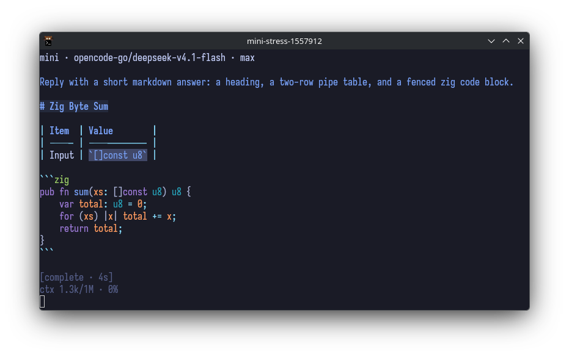

# mini-coding-agent

A fast, transparent, config-first terminal coding agent.

<p align="center">
  
</p>

## Build

Requires Zig 0.16.0.

    zig build

The binary lands at `zig-out/bin/mini`.

## Run

    mini                 # interactive TUI
    mini -p '<prompt>'   # one turn, print the reply, exit
    mini -c <file>       # overlay a config file for this run

Arguments:

| Flag | Meaning |
|---|---|
| `-p`, `--print` | run one prompt non-interactively and print the assistant text |
| `-c`, `--config` | read a config file after the global one; its keys win |

`-p` requires a model in the config. Without one it exits 1 and prints where
the config lives. Interactive mode requires a TTY.

## TUI commands

| Command | Meaning |
|---|---|
| `/help` | list commands and keybindings |
| `/new` | start a new session |
| `/provider` | choose the provider and model |
| `/model` | choose a model for the current provider |
| `/thinking` | set the thinking level |

`/provider`, `/model`, and `/thinking` write the change back to the config file.

## Keybindings

| Key | Meaning |
|---|---|
| `Enter` | submit |
| `Shift+Enter` | newline (`Ctrl+J` also works) |
| `Esc` | pause the turn at the next step boundary |
| `Ctrl+C` | cancel the turn |
| `Ctrl+D` | exit on an empty draft |
| `Tab` | complete command or path |

## Configure

The config is one JSON object. It is read from
`$XDG_CONFIG_HOME/mini-coding-agent/config.json`, else
`$HOME/.config/mini-coding-agent/config.json`. A missing file means every
default. There is no project-local config. `-c` reads a second file over it.

A full example:

```json
{
  "provider": "opencode",
  "model": "deepseek-v4.1-flash",
  "thinkingEffort": "medium",
  "theme": "tokyonight",
  "systemPrompt": "Be terse.",
  "sessionsDir": "/home/me/.local/state/mini-coding-agent/sessions",
  "discoverAgentFiles": true,
  "skillsDirs": ["/home/me/.agents/skills"],
  "tools": ["edit", "read", "bash"],
  "customProviders": [
    {
      "id": "local",
      "name": "Local",
      "models": [
        {
          "id": "qwen3-coder",
          "api": "openai-completions",
          "baseUrl": "http://127.0.0.1:11434/v1",
          "context": 32768,
          "maxOutput": 8192,
          "images": false,
          "reasoning": true,
          "effort": ["low", "high"],
          "cost": [0, 0, 0]
        }
      ],
      "envKeys": ["LOCAL_API_KEY"],
      "headers": { "x-tenant": "mini" }
    }
  ]
}
```

Keys:

| Key | Default | Meaning |
|---|---|---|
| `provider` | unset | provider id; built-ins are `opencode` and `opencode-go`, or a `customProviders` id |
| `model` | unset | model id |
| `thinkingEffort` | unset | one of `off`, `minimal`, `low`, `medium`, `high`, `xhigh`, `max`; unset sends no reasoning parameter and clamps to what the model accepts |
| `theme` | `tokyonight` | TUI palette: `tokyonight`, `oxocarbon`, or `kanagawa`. Read at startup; there is no live reload |
| `systemPrompt` | `""` | prepended to the system prompt |
| `sessionsDir` | `$XDG_STATE_HOME/mini-coding-agent/sessions`, else `$HOME/.local/state/mini-coding-agent/sessions`, else `sessions` | where JSONL session logs go |
| `discoverAgentFiles` | `true` | load `AGENTS.md`/`CLAUDE.md` from `$HOME/.agents` and the cwd |
| `skillsDirs` | `[]` | directories holding `<name>/SKILL.md` skills |
| `tools` | `["edit", "read", "bash"]` | which tools the model sees |
| `customProviders` | `[]` | in-tree provider definitions |

Unknown keys are rejected. `provider` and `model` must both be set to make a
request; a custom provider must list the model in its `models`.

A `customProvider` field:

| Field | Required | Meaning |
|---|---|---|
| `id` | yes | the id `provider` selects |
| `name` | no | display name; falls back to `id` |
| `models` | yes | non-empty list of model objects |
| `envKeys` | no | environment variables searched, in order, for the API key |
| `headers` | no | extra request headers |

A `customProvider` model object; every model carries its own wire and metadata,
so one provider may mix APIs and base URLs:

| Field | Required | Meaning |
|---|---|---|
| `id` | yes | the id `model` selects |
| `name` | no | display name; falls back to `id` |
| `api` | yes | one of `openai-completions`, `openai-responses`, `anthropic-messages`, `google-generative-ai` |
| `baseUrl` | yes | request base URL |
| `context` | yes | context window in tokens |
| `maxOutput` | yes | maximum output tokens |
| `images` | yes | whether the model accepts image input |
| `reasoning` | yes | whether the model reasons |
| `effort` | no | accepted thinking levels; empty means the full ladder |
| `cost` | yes | `[input, output, cache-read]` USD per million tokens |

## Environment

The built-in providers read `OPENCODE_API_KEY`. Custom providers read the first
present variable in their `envKeys`. A provider without a key is listed but
fails at request time.

## Sessions

Each session is a JSONL directory under `sessionsDir`. Every message and every
model request is appended and fsynced. The log is write-only; a write failure
stops the turn.
